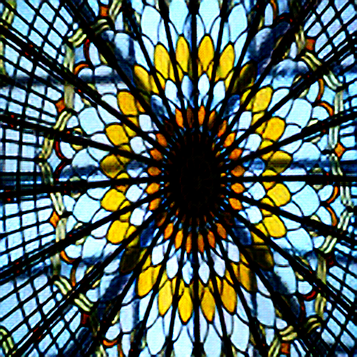

# Implementations of Super Resolution via Generative Models using PyTorch

### 0. Introduction
This repository contains implementations of SRGAN and ESRGAN.
- [Photo-Realistic Single Image Super-Resolution Using a Generative Adversarial Network](https://arxiv.org/abs/1609.04802)
- [ESRGAN: Enhanced Super-Resolution Generative Adversarial Networks](https://arxiv.org/abs/1809.00219)

I used the [DIV2K](https://data.vision.ee.ethz.ch/cvl/DIV2K/) dataset and aimed to upscale 128 resolution image 512 one. 
Unfortunately I couldn't yield the 'photo-realistic' results like samples in the papers. 
If you have any appropriate methods or (hyper) parameters, please let me know. I will modify it.

### 1. Quantitative Analysis
| Method | PSNR | MSE | SSIM |
|:---:|:---:|:---:|:---:|
| Bicubic | 25.137 ± 2.832 | 0.244 ± 0.172 | 0.714 ± 0.113 |
| SRGAN | 12.241 ± 2.561 | 0.893 ± 0.471 | 0.542 ± 0.091 |
| ESRGAN | 27.132 ± 3.095 | 0.169 ± 0.107 | 0.797 ± 0.086 |

### 2. Qualitative Anaylsis

| Sort | Image 1 | Image 2 | Image 3 |
|:---:|:---:|:---:|:---:|
| Target |  |  |  |
| Bicubic |  |  |  |
| SRGAN |  |  |  |
| ESRGAN |  |  |  |


### 3. Run the Codes
#### 1) Dataset
```
python prepare_dataset.py
```

After running the code, the directory should be the same as follows:
```
+---[data]
     \----[hr_train]
           +---[0000.png]
           |...
           +---[0799.png]
     \----[lr_train]
           +---[0000.png]
           |...
           +---[0799.png]
     \---[hr_valid]
           +---[0000.png]
           |...
           +---[0099.png]
     \---[lr_valid]
           +---[0000.png]
           |...
           +---[0099.png]
+---config.py
+---download_dataset.sh
|   ...
+---utils.py
```

#### 2) Train
You can train either SRGAN or ESRGAN.
```
python train.py --sort 'SRGAN'
```

```
python train.py --sort 'ESRGAN'
```
Also, you can choose the discriminator type using `--disc type` option. It supports `fcn`, `conv`, `patch`, which stands for `fully connected layers`, `fully convolutional layers` and `PatchGAN`. 

#### 3) Generate Samples (Single Image)
Place the weights file of both networks to `./results/weights/`.

```
python single_inference.py
```

### Development Environment
```
- Ubuntu 18.04 LTS
- NVIDIA GFORCE GTX 1080 ti
- CUDA 10.2
- torch 1.5.1
- torchvision 0.5.0
- etc
```
